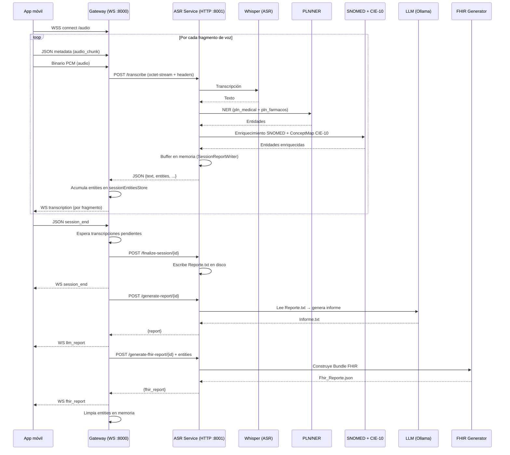

# Validación del pipeline de datos

Validación del flujo de información desde la aplicación móvil, pasando por WebSocket y Gateway, hasta el servicio de transcripción, el procesamiento completo, el almacenamiento de transcripción y entidades nombradas, y la generación de informes FHIR e informe LLM.

**Fecha de validación:** 13 de junio de 2026  
**Fuentes revisadas:** `generacion-informes/`, `backend/gateway/`, `backend/asr-service/`, `latex/capitulos/02_Marco_Teorico_y_Referencial.tex`

---

## Pipeline validado (implementación real)



---

## Validación paso a paso

### 1. App móvil → WebSocket → Gateway

**Estado: Correcto.**

La app (`generacion-informes`) graba audio PCM, lo segmenta con VAD y envía por par de mensajes WebSocket:

1. JSON con metadatos (`type: audio_chunk`, `sessionId`, `sequence`, etc.)
2. Binario PCM del fragmento

**Archivos clave:**

- `generacion-informes/src/services/websocket/AudioStreamWebSocketClient.js` — envía `JSON.stringify(metadata)` seguido de `pcmBytes`
- `backend/gateway/index.js` — escucha en `ws://<host>:8000/audio`
- `backend/gateway/handlers/audioWebSocketHandler.js` — distingue JSON (metadatos) de binario (audio)

**Matiz respecto al TFM:** el diagrama WSS (`fig:diagrama_wss`) muestra conexión directa móvil ↔ "Servidor Backend". En la implementación, el punto de entrada WebSocket es el **Gateway** (puerto 8000), no el ASR service.

---

### 2. Gateway → POST al servicio de transcripción

**Estado: Correcto.**

El gateway actúa como puerta de entrada y reenvía cada fragmento al ASR service por HTTP POST:

- **URL:** `POST http://127.0.0.1:8001/transcribe`
- **Body:** `application/octet-stream` (audio PCM)
- **Cabeceras:** `X-Session-Id`, `X-Sequence`, `X-Timestamp`

**Archivo clave:** `backend/gateway/services/asrTranscribeClient.js`

---

### 3. Pipeline de procesamiento en ASR Service (`POST /transcribe`)

**Estado: Correcto y alineado con el marco conceptual del TFM.**

En cada fragmento de audio, el ASR service ejecuta:

| Etapa | Implementación | Ubicación |
|-------|----------------|-----------|
| ASR (Whisper) | `provider.transcribe(chunk)` | `routes.py:421` |
| PLN/NER | `pln_orchestrator.process_text()` (2 modelos en paralelo) | `routes.py:458` |
| Agrupación de entidades | `group_entities()` (términos multi-palabra) | `routes.py:462` |
| SNOMED CT | `enrich_entities()` | `routes.py:466` |
| CIE-10-ES | `_translate_entities()` vía ConceptMap FHIR | `routes.py:471-474` |
| Almacenamiento temporal | `SessionReportWriter.append_call()` (buffer en memoria) | `routes.py:484-494` |

La respuesta JSON incluye `text` + `entities` enriquecidas.

**Modelos PLN en paralelo:**

- `pln_medical` — NER médico general
- `pln_farmacos` — terminología farmacológica

---

### 4. Almacenamiento de transcripción y entidades

**Estado: Parcialmente correcto en el TFM — hay que precisar dónde se guarda cada cosa.**

| Dato | Dónde se almacena | Cuándo |
|------|-------------------|--------|
| Transcripción + entidades (control) | **ASR Service** → `reports/<session_id>/Reporte.txt` | Al `POST /finalize-session` |
| Entidades (para FHIR) | **Gateway** → `sessionEntitiesStore` (memoria) | Tras cada `/transcribe` |
| Informe LLM | **ASR Service** → `reports/<session_id>/Informe.txt` | Al `POST /generate-report` |
| Bundle FHIR | **ASR Service** → `reports/<session_id>/Fhir_Reporte.json` | Al `POST /generate-fhir-report` |

El gateway **no persiste la transcripción**; solo acumula entidades en memoria y reenvía la transcripción al móvil en tiempo real.

**Archivos clave:**

- `backend/gateway/services/sessionEntitiesStore.js` — acumulador en memoria de entidades
- `backend/asr-service/app/services/session_report.py` — escritura de `Reporte.txt` al finalizar sesión

---

### 5. Fin de sesión → Informes FHIR y LLM

**Estado: Correcto en modo streaming** (modo por defecto).

Secuencia al recibir `session_end`:

1. Espera a que terminen las transcripciones pendientes (`Promise.allSettled`)
2. `POST /finalize-session/{id}` → escribe `Reporte.txt` en disco
3. Envía `WS session_end` al móvil
4. `POST /generate-report/{id}` → LLM lee `Reporte.txt` y genera `Informe.txt`
5. Envía `WS llm_report` al móvil
6. `POST /generate-fhir-report/{id}` con entidades acumuladas en el gateway
7. Envía `WS fhir_report` al móvil
8. Limpia entidades en memoria del gateway

**Orden:** finalize → LLM → FHIR (coherente con `backend/asr-service/README.md`).

**Archivo clave:** `backend/gateway/handlers/audioWebSocketHandler.js` (líneas 75-150)

El LLM lee `Reporte.txt` (transcripción + NER + SNOMED + CIE-10) y actúa como redactor, no como fuente primaria de diagnóstico — alineado con la sección del LLM en el capítulo 2 del TFM.

---

## Discrepancias entre el TFM y la implementación

### Críticas (afectan la exactitud del documento)

#### 1. Figura `fig:diagrama_conceptual` inexistente

Se referencia en la línea 235 de `02_Marco_Teorico_y_Referencial.tex` pero el `\label` está comentado (línea 248). La compilación mostrará una referencia rota.

#### 2. "Backend" vs Gateway

El texto dice que el audio va "desde la aplicación móvil hacia el backend mediante WebSocket" (línea 240), pero el WebSocket termina en el **Gateway**. El "backend" de procesamiento es el **ASR Service**, al que el gateway accede vía HTTP POST.

#### 3. "El gateway almacena transcripción y entidades"

Solo almacena **entidades** (en memoria). La **transcripción** la persiste el ASR Service al finalizar la sesión.

#### 4. Diagrama WSS

Muestra "Servidor Backend" como destino del WebSocket; debería ser **Gateway** como intermediario, con flecha HTTP hacia ASR Service.

---

### Menores (redacción / detalle)

#### 5. Typos en el TFM

- Línea 241: "transcripción textual textual" → "transcripción textual"
- Línea 243: "Envejecimiento Óntico" → "Enriquecimiento Ontológico"

#### 6. App móvil no consume los informes

Tras `session_end`, la app desconecta el WebSocket sin escuchar `transcription`, `llm_report` ni `fhir_report`.

**Archivo:** `generacion-informes/src/hooks/useAudioCaptureSession.js` (líneas 185-192)

Los informes se generan y se envían por WS, pero el cliente actual no los procesa. Los artefactos quedan en disco en el servidor (`Reporte.txt`, `Informe.txt`, `Fhir_Reporte.json`).

#### 7. Modo batch incompleto

`_handleBatchSessionEnd` transcribe el audio acumulado pero **no** llama a `finalizeSession`, `generateReport` ni `generateFhirReport`. No afecta al modo por defecto (`streaming`).

---

## Veredicto por etapa del marco conceptual

Sección "Flujo Arquitectónico de Datos y Conocimiento" (`02_Marco_Teorico_y_Referencial.tex`, líneas 234-245):

| Etapa del TFM | ¿Implementada? | Observación |
|---------------|----------------|-------------|
| 1. Captura e ingesta (Audio) vía WS | ✅ Sí | Gateway, no ASR directamente |
| 2. ASR (Whisper) | ✅ Sí | Dentro de ASR Service |
| 3. PLN/NER | ✅ Sí | Dos modelos en paralelo |
| 4. SNOMED CT / CIE-10-ES | ✅ Sí | SNOMED + ConceptMap FHIR |
| 5. LLM con contexto enriquecido | ✅ Sí | Lee `Reporte.txt` con todo el contexto |
| 6. Generación FHIR | ✅ Sí (no documentada en TFM) | Conviene añadirla como paso explícito |

---

## Estructura de artefactos por sesión

```text
reports/
  <session_id>/
    Reporte.txt        # transcripción, NER y SNOMED (control)
    Informe.txt        # informe médico LLM
    Fhir_Reporte.json  # Bundle FHIR (Patient + recursos por entidad NER/SNOMED)
```

---

## Recomendaciones para el capítulo 2 del TFM

1. **Añadir un diagrama de arquitectura** (`fig:diagrama_conceptual`) con tres capas: Móvil → Gateway (WSS) → ASR Service (HTTP), y el pipeline interno del ASR.
2. **Reescribir el punto 1** del flujo arquitectónico: "La app móvil envía audio al **Gateway** por WSS; el Gateway reenvía cada fragmento al **servicio ASR** por POST".
3. **Aclarar el almacenamiento:** Gateway acumula entidades en memoria; ASR Service persiste transcripción, entidades, informe LLM y FHIR en `reports/<session_id>/`.
4. **Añadir paso 6:** "Generación de recursos FHIR (Bundle R4B) a partir de las entidades enriquecidas".
5. **Corregir typos** mencionados en la sección de discrepancias.

---

## Referencias de código

| Componente | Ruta |
|------------|------|
| Cliente WebSocket (móvil) | `generacion-informes/src/services/websocket/AudioStreamWebSocketClient.js` |
| Hook de captura de audio | `generacion-informes/src/hooks/useAudioCaptureSession.js` |
| Gateway (entrada WS) | `backend/gateway/index.js` |
| Handler WebSocket | `backend/gateway/handlers/audioWebSocketHandler.js` |
| Cliente HTTP → ASR | `backend/gateway/services/asrTranscribeClient.js` |
| Store de entidades (gateway) | `backend/gateway/services/sessionEntitiesStore.js` |
| API de transcripción | `backend/asr-service/app/api/routes.py` |
| Escritura de reportes | `backend/asr-service/app/services/session_report.py` |
| Generador LLM | `backend/asr-service/app/services/llm_report_generator.py` |
| Generador FHIR | `backend/asr-service/app/services/fhir_report_generator.py` |
| Constantes gateway | `backend/shared/constants/GatewayConstants/gatewayConstants.js` |
